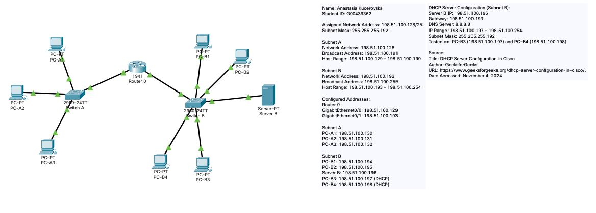

# Networking with Cisco Packet Tracer

## Overview
This project involves the design and configuration of a small office network using Cisco Packet Tracer. The network utilizes subnetting, IP addressing, and includes additional configurations such as a DHCP server for dynamic IP assignment. The network is tested for connectivity to ensure all devices can communicate with each other.

## Files
- **Assignment-Files/[Kucerovska_Anastasia_G00439362].pkt**: The Cisco Packet Tracer file with the completed network configuration.
- **Assignment-Files/Addressing-Scheme.docx**: A Word document detailing:
  - Network address and subnet mask.
  - Subnet details: network addresses, broadcast addresses, and host ranges.
  - Configured IP addresses for all devices.
- **Assignment-Files/networking_project_spec.pdf**: The original assignment brief.
- **packet_tracer.png**: A screenshot of the network topology in Packet Tracer.

## Key Features
- **Subnetting**: Divided 198.51.100.128/25 into subnets to accommodate up to 60 hosts each.
- **Connectivity**: Ensured all devices can communicate (e.g., via ping).
- **DHCP Server Configuration**: A DHCP server is set up in Subnet B to dynamically assign IP addresses to devices.
- **Documentation**: Included detailed addressing information in the Word document and a note with IP configurations on the Packet Tracer file.
- **Extra Credit (Optional)**: DHCP server configuration for automatic IP assignment in Subnet B.

## Visuals
Here’s a screenshot of the network topology:

  

## How to Use
1. Open the `.pkt` file using Cisco Packet Tracer.
2. Refer to the Word document for the detailed IP addressing scheme.
3. Review the project specification PDF for context.

## Author
**Anastasia Kucerovska**  
Student ID: **G00439362**
